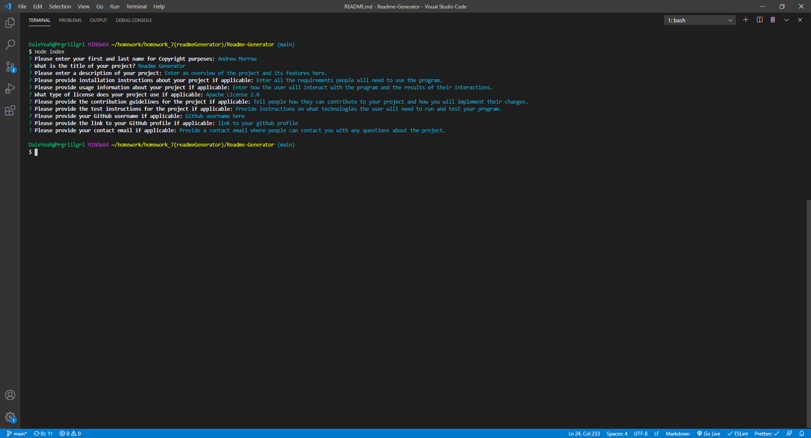

# Readme Generator

## Description

This is a modular program that generates a high quality README.md file from user input.

## Table of Contents

-   [Installation Instructions](#installation-instructions)
-   [Usage Information](#usage-information)
-   [License](#license)
-   [Contribution Guidelines](#contribution-guidelines)
-   [Test Instructions](#test-instructions)
-   [Questions](#questions)

## Installation Instructions

This application requires Node.js which can be downloaded <a href="https://nodejs.org/en/" target="_blank">here</a>. It utilizes a node module called <a href="https://www.npmjs.com/package/inquirer" target="_blank">inquirer</a> and can be installed using <a href="https://www.npmjs.com/" target="_blank">node package manager</a>. Once you have node with inquirer installed then you are ready to generate a readme!

## Usage Information

The user will be prompted with questions about their project. Once all of the user inputs are collected the program will generate a README.md file in the genReadme folder. The user may then copy the file to use in their own project.

Click the image below to view the demo video!

## License

This project is utilizing the Apache License 2.0

## Contribution Guidelines

This is a fully open source project, you may fork the repository and any pull requests will be viewed and implemented accordingly.

## Test Instructions

To test the software you will need node.js installed. It also requires the use of the filesystem module and the inquirer module to be installed via node package manager.

## Questions

If there are further questions please contact me with the following.

 AndrewMorrow - <a href="https://github.com/AndrewMorrow" target= "_blank">Github</a>

Email: beardedmongo@gmail.com
